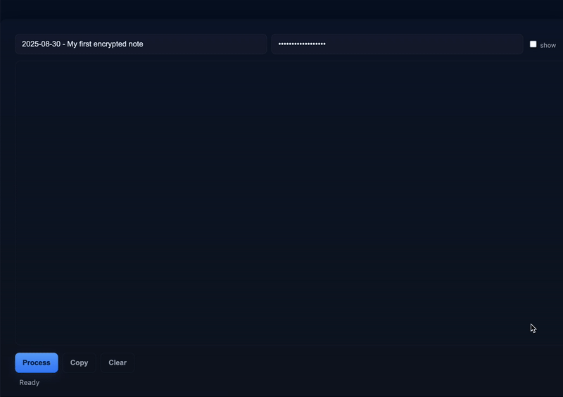

# enc - Local & offline text encryption/decryption

`enc.html` is a tiny, dependency-free tool to quickly encrypt and decrypt small pieces of text (notes, secrets, configuration snippets) locally in your browser. 

([Try it](https://yusufb.github.io/enc/enc.html))



It is single-file, client-only HTML+JavaScript tool that encrypts and decrypts text in your browser using a passphrase: no servers, no backend/network requests, and no telemetry. All key derivation, encryption and decryption are executed by the browser's `crypto.subtle` APIs locally.

Obviously, **not intended** as a full-featured password manager, secret vault, or as a replacement for audited, production-grade crypto systems. If you want stronger KDFs (Argon2, scrypt), include a WebAssembly or JS implementation. PBKDF2 was chosen for native browser support.

## How encryption & decryption work

- When encrypting:
    1. A random **salt** and random **IV** (initialization vector or nonce) are generated.
    2. PBKDF2 (HMAC-SHA256) derives a 256-bit AES key from your passphrase and the salt.
    3. AES‑GCM encrypts the UTF‑8 plaintext with the derived key and IV, producing ciphertext and an
       authentication tag.
    4. The JSON package containing metadata (`salt`, `iv`, `iter`, `title`) and `ct` (base64
       ciphertext+tag) is produced for storage/transmission.

- When decrypting:
    1. The tool reads `salt`, `iv`, `ct`, and `iter` from the JSON package.
    2. It re-derives the AES key with PBKDF2 using the salt and iterations.
    3. AES‑GCM attempts to decrypt and verify the authentication tag; if verification passes,
       plaintext is returned.

## Cryptographic parameters & file format

- **KDF:** PBKDF2 (HMAC-SHA256)
    - Default iterations: **1,000,000**
    - Salt length: **16 bytes**
- **Cipher:** AES-GCM, **256-bit** key (derived)
    - IV length: **12 bytes**
    - Authentication tag: standard (handled by Web Crypto)
- **Output:** JSON envelope (base64-encoded binary fields).

Example:

```json
{
  "title": "2025-01-01",
  "v": 1,
  "kdf": "PBKDF2",
  "alg": "AES-GCM",
  "iter": 1000000,
  "salt": "q1a2+...base64==",
  "iv": "x7bF...base64==",
  "ct": "2F0a...base64=="
}
```

## License & disclaimer

- **License:** MIT - feel free to copy, modify, and adapt.
- **Disclaimer:** Educational utility code for local/offline use. It is **not** a substitute for audited cryptographic software for protecting extremely sensitive assets. Use at your own risk.
